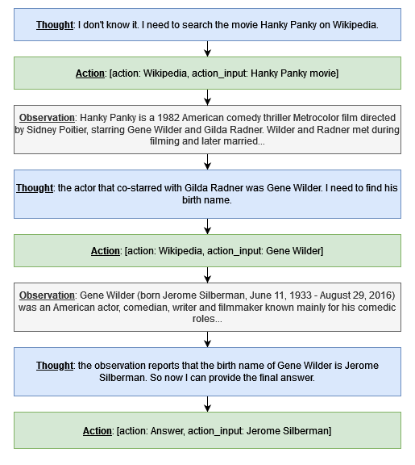

# Araft

Araft (**A**chieve **R**eAct **A**gent through **F**ine-**T**uning) is a language agent capable of answering questions using Wikipedia queries. The agent is developed from a relatively small language model (7 billion parameters) and it draws inspiration from the renowned ReAct resoultion pattern [[1]](#1).

The ReAct pattern consists in solving tasks in cycles made of three steps: Thought, Action and Observation. For example, in the case of a Wikipedia-augmented agent for question-answering, the cycle may consist of the following:
- Thought: reason explicitly over the current knowledge and plan the next action
- Action: call Wikipedia tool or provide the Answer. If the Answer is provided, the cycling stops. 
- Observation: report the result of the Wikipeda query in order to use it for the next cycle.

Here is an example of the trajectory of a Wikipedia-agumented ReAct agent for the question "**What is the birth name of the actor that co-starred with Gilda Radner in the film Hanky Panky?**"     
  
&nbsp;

The Araft ReAct agent is a result of the fine-tuning of Llama2-7B [[2]](#2), the Llama2 model with 7 billion parameters. It has a performance of 26% (F1 score) in providing the right answer to the hotpotQA dataset [[3]](#3). This result is comparable to that of a non-fine-tuned model with a size ten times larger, such as the Llama2 with 70 billion parameters. The Araft model and the trajectory dataset can be found under the following links:  
- [model](https://huggingface.co/FDeRubeis/araft_trained_dpo)
- [trajectory dataset](https://huggingface.co/datasets/FDeRubeis/araft)

This repository contains the code to reproduce the Araft training and to evaluate it on the hotpotQA dataset. For further details about the steps taken to train the Araft agent and the performance achieved, please see the [technical_notes](technical_notes.md) page.

## Built with

- [langchain](https://www.langchain.com/): build agents powered by LLMs (Large Language Models)
- [transformers](https://huggingface.co/docs/transformers/en/index): download, fine-tune and use pre-trained models
- [bitsanbytes](https://huggingface.co/docs/bitsandbytes/main/en/index): reduce size of LLMs through quantization
- [peft](https://huggingface.co/docs/peft/en/index): efficiently fine-tune LLMs

## Installation

```sh
# Clone the repo
git clone https://github.com/FDeRubeis/Araft
export ARAFT_PATH= # path to Araft dir
cd $ARAFT_PATH

# install required packages
pip install -r requirements.txt

# optional: install packages for tests
pip install -r dev-requirements.txt
```

Note: Araft was tested with Python 3.12.2

## Example Usage

Prepare the environment:
```sh
cd $ARAFT_PATH
export PYTHONPATH=$ARAFT_PATH:$PYTHONPATH
export HF_TOKEN= # your Huggingface token
```

Fine-tune model:
```sh
MODEL_70B="meta-llama/Llama-2-70b-chat-hf"
MODEL_7B="meta-llama/Llama-2-7b-chat-hf"
DATASET= # path to hotpotQA training dataset

# generate trajectories
python scripts/traj_generator.py $MODEL_70B $DATASET

# convert trajectories to SFT data
python scripts/traj_to_SFT_converter.py $MODEL_7B output/trajectories/trajectories.json

# train model with SFT
python scripts/sft_trainer.py $MODEL_7B output/SFTdata.csv

# convert trajectories to DPO data
python scripts/traj_to_DPO_converter.py $MODEL_7B output/trajectories/trajectories.json

# train model further with DPO
python scripts/dpo_trainer.py $MODEL_7B output/araft_trained_sft output/DPOdata.csv
```

Evaluate:
```sh
EVAL_DATASET= # path to hotpotQA evaluation dataset

# evaluate final (DPO trained) model
python scripts/evaluator_hotpot.py output/araft_trained_dpo $EVAL_DATASET --samples 100 100 100 --subfolder dpo_trained
```

## References

<a id="1">[1]</a> 
Yao, Shunyu et al. "ReAct: Synergizing Reasoning and Acting in Language Models." ArXiv abs/2310.05915 (2023).

<a id="2">[2]</a> 
Hugo, Touvron et al. "Llama 2: Open Foundation and Fine-Tuned Chat Models." (2023).

<a id="3">[3]</a> 
Yang, Zhilin et al. "HotpotQA: A Dataset for Diverse, Explainable Multi-hop Question Answering." Conference on Empirical Methods in Natural Language Processing (EMNLP). 2018.